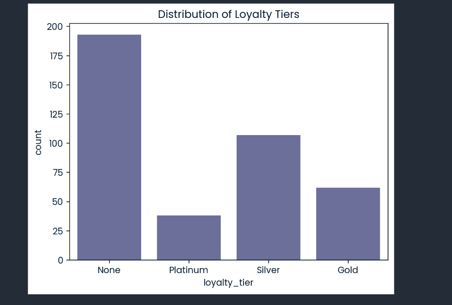
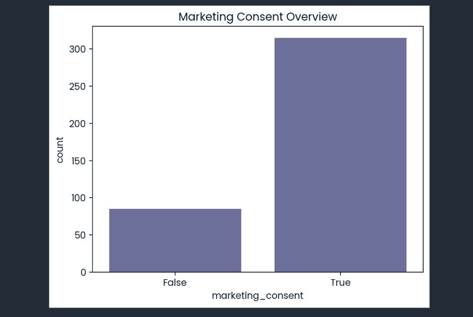
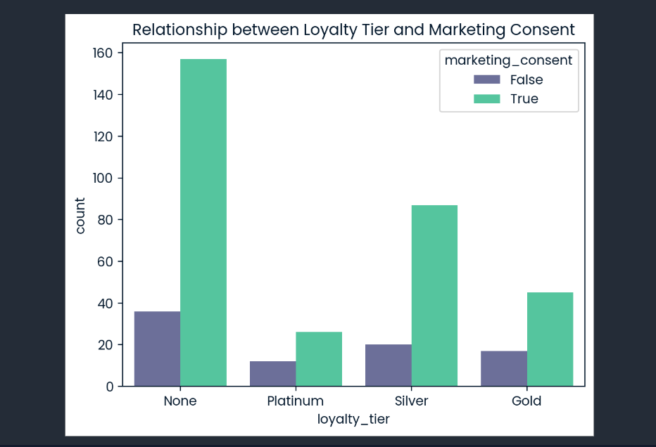

# 🧑‍💼Guest Loyalty Analysis
This Python-based analytical tool evaluates guest data to pinpoint high-value customers who are ideal candidates for loyalty program expansion. By leveraging data visualization and behavioral analysis, it identifies a primary growth segment of 157 guests ready for immediate enrollment.

(Open notebook.ipynb in Jupyter or VS Code)

## Visual Insights
I found that nearly 50% of the guests are not yet enrolled in any tier.

## Marketing Consent Overview              
The vast majority of guests are reachable via marketing channels.

## Relationship: Tier vs. Consent         
Critically, 157 guests in the "None" category have already provided consent—this is our primary growth target.

## Key Features / Insights
* Validated 400 rows of guest data with 0% duplicates.
* Visualized the relationship between loyalty tiers and marketing consent.
* Calculated a baseline Loyalty Enrollment Rate of 51.75%.

## Project Structure
A simple text tree showing what the files are.          

├── Images/     ---> Plots and charts for the README        
├── data/       --->                Raw and processed data               
├── notebooks/  --->                Jupyter notebook for analysis         
└── README.md

## Technologies Used
* Pandas for data manipulation.
* Seaborn/Matplotlib for visualization.
* Jupyter for interactive analysis.

