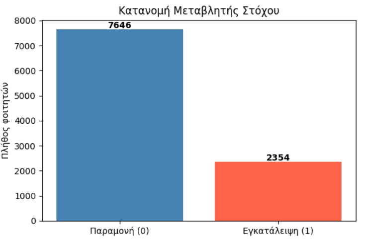
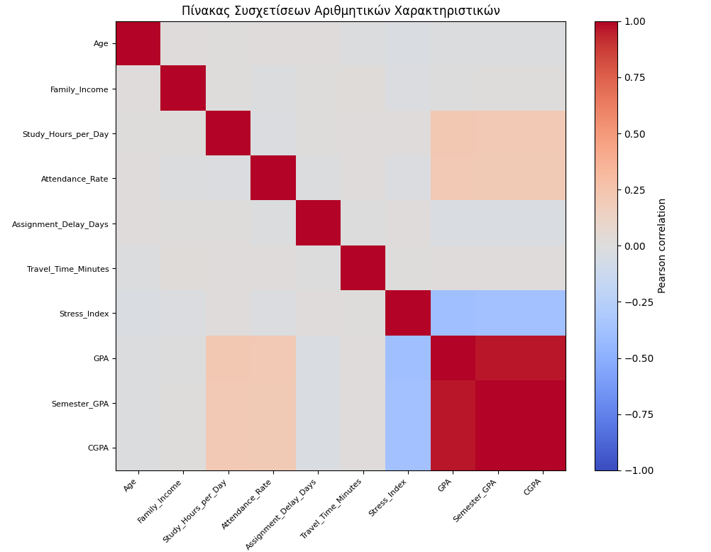
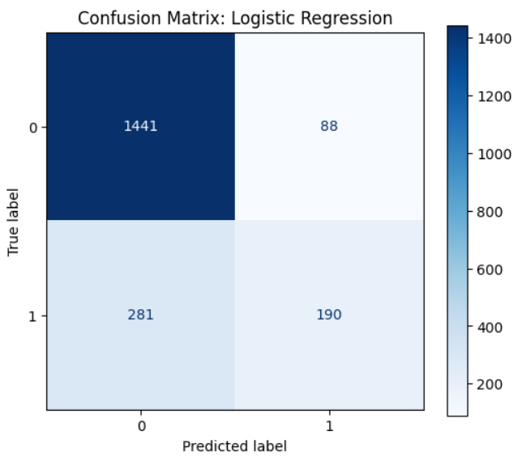
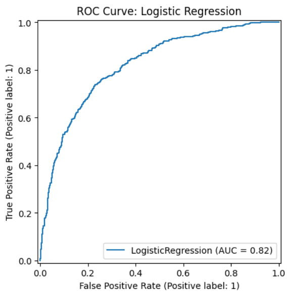
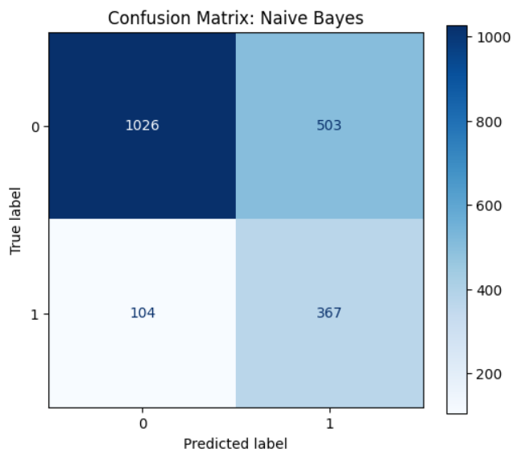
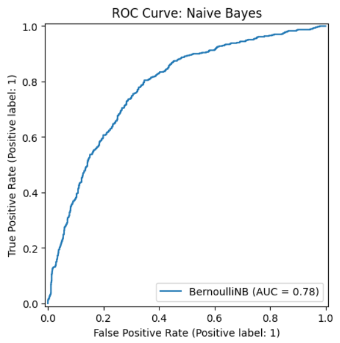
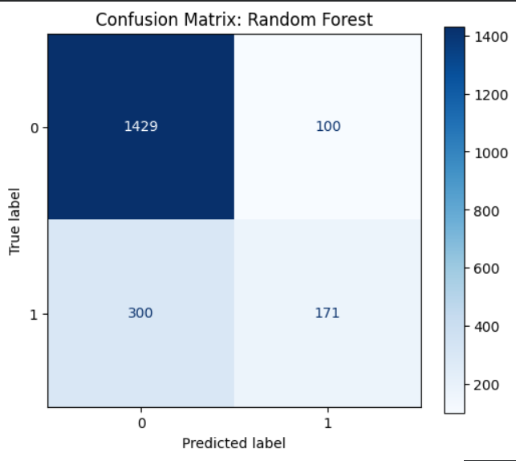
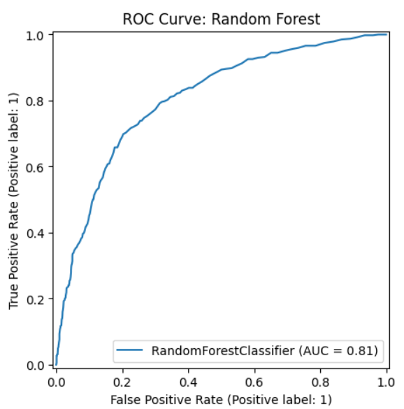

# 👨‍🎓 Student Dropout Analysis
This project aims to predict the likelihood of student dropout using various machine learning algorithms. By analyzing lifestyle habits, academic performance, and demographic data, the model provides data-driven insights to help educational institutions implement early intervention strategies.           
(Open notebook.ipynb in Jupyter or VS Code)

## Visual Insights
Below are the key evaluation metrics and distributions from the analysis:

### 1. Target Variable Distribution
This bar chart visualizes the distribution of the target variable, showing a significant class imbalance between students who stayed and those who dropped out.

### 2. Feature Correlation Matrix
The heatmap displays the Pearson correlation coefficients between numerical features, highlighting strong relationships between academic metrics like GPA and CGPA.

### 3. Confusion Matrix: Logistic Regression
The confusion matrix for the Logistic Regression model illustrates its performance in correctly identifying true negatives while struggling with a higher number of false negatives.

### 4. ROC Curve: Logistic Regression
The ROC curve for Logistic Regression shows an AUC of 0.82, indicating a strong ability to distinguish between student dropout and retention classes.

### 5. Confusion Matrix: Naive Bayes
The Naive Bayes confusion matrix reveals a high recall for the dropout class but also a significant number of false positives compared to other models.

### 6. ROC Curve: Naive Bayes
The Naive Bayes ROC curve achieves an AUC of 0.78, reflecting its probabilistic approach to classification despite a lower overall accuracy.

### 7. Matrix: Random Forest
The Random Forest confusion matrix demonstrates the ensemble model's effectiveness in maintaining high accuracy for both student categories.

### 8. ROC Curve: Random Forest
The Random Forest ROC curve yields an AUC of 0.81, confirming its robustness and competitive performance in predicting student dropout likelihood.

## Key Features / Insights
* **Model Comparison**: Evaluated Logistic Regression, Naive Bayes, and Random Forest to find the best balance between precision and recall.

* **Feature Importance**: Identified that factors such as GPA, attendance rate, and study hours are the most significant predictors of student success.

* **Class Imbalance Handling**: Addressed the disproportionate number of students who stay vs. those who drop out to ensure model reliability.

* ** Actionable Metrics: Achieved a high ROC-AUC score, indicating strong model capability in distinguishing between dropout and non-dropout cases

## Project Structure
A simple text tree showing what the files are.          

├── images/     --->                Plots and charts for the README        
├── data/       --->                Raw and processed data               
├── notebooks/  --->                Jupyter notebook for analysis         
└── README.md

## Technologies Used
* **Python**: The core language used for the analysis.

* **Pandas**: For robust data manipulation and cleaning.

* **Scikit-Learn**: For implementing and tuning machine learning models.

* **Seaborn & Matplotlib**: For creating detailed statistical visualizations.

* **Google Colab**: For an interactive and documented analysis environment.
