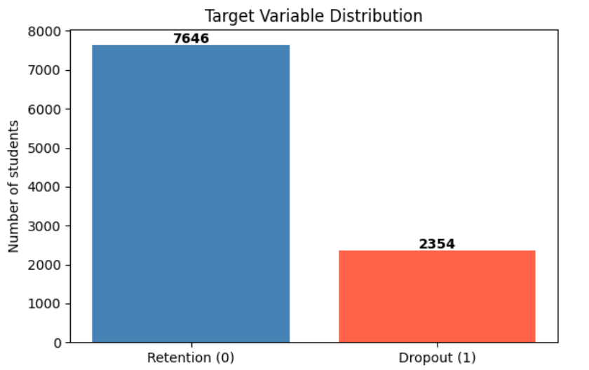
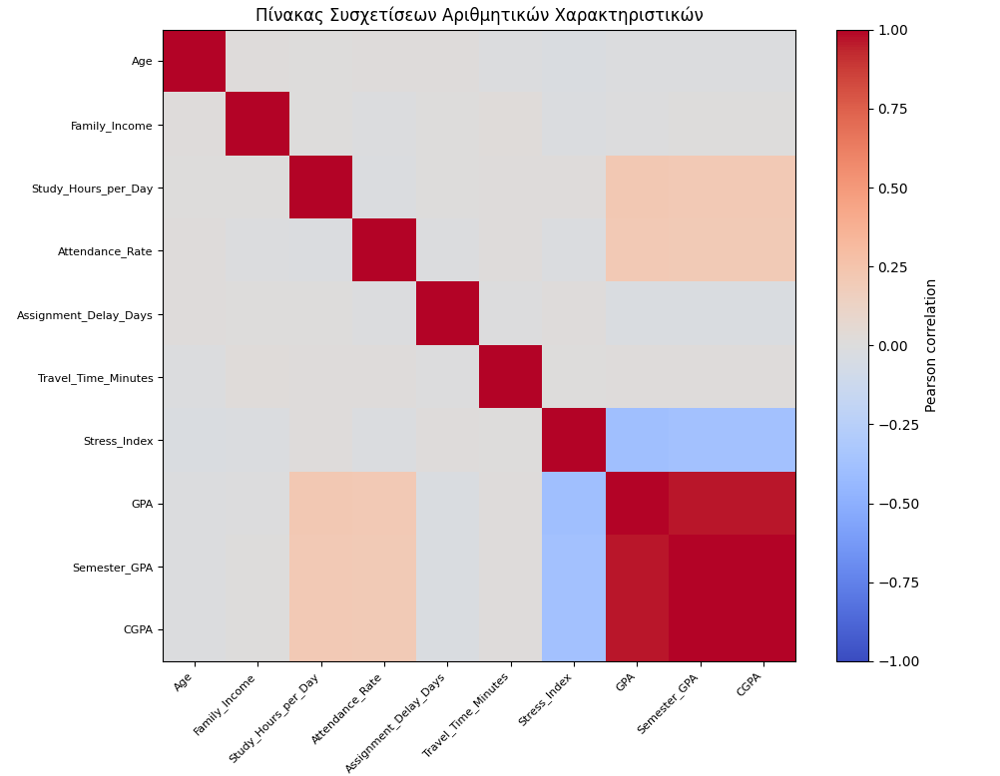
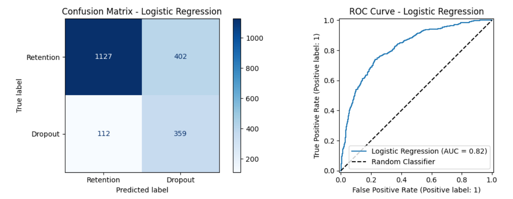
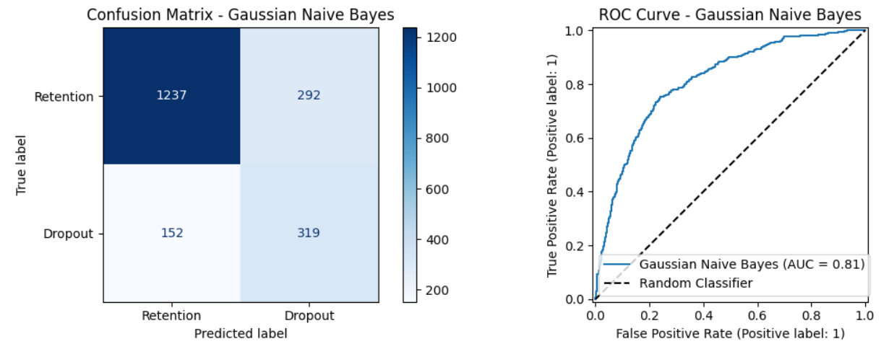
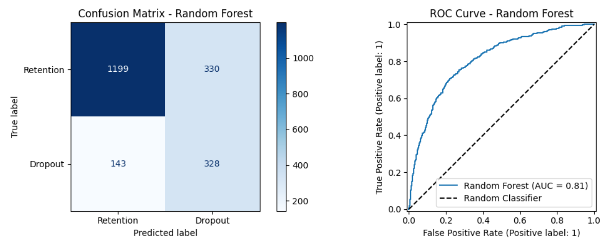

# 👨‍🎓 Student Dropout Analysis
I analyzed 10,000 student records to compare three machine learning models predicting dropout risk, achieving 0.82 ROC-AUC and 76% recall with the best-performing model — prioritizing detection of at-risk students over raw accuracy, to support early intervention strategies for educational institutions.

## Dataset
Synthetic dataset of 10,000 student records with 19 features covering demographic, academic, and lifestyle indicators (e.g. GPA, CGPA, attendance rate, study hours). Target variable: binary dropout classification, with a class imbalance of 76.5% retention vs. 23.5% dropout.

## Visual Insights
Below are the key evaluation metrics and distributions from the analysis:

### 1. Target Variable Distribution
This bar chart visualizes the distribution of the target variable, showing a significant class imbalance between students who stayed and those who dropped out.



### 2. Feature Correlation Matrix
The heatmap displays the Pearson correlation coefficients between numerical features, highlighting strong relationships between academic metrics like GPA and CGPA.



### 3. Confusion Matrix - ROC Curve: Logistic Regression
The confusion matrix for the Logistic Regression model illustrates its performance in correctly identifying true negatives while struggling with a higher number of false negatives. The ROC curve for Logistic Regression shows an AUC of 0.82, indicating a strong ability to distinguish between student dropout and retention classes.



### 4. Confusion Matrix - ROC Curve: Naive Bayes
The Naive Bayes confusion matrix reveals a high recall for the dropout class but also a significant number of false positives compared to other models. The Naive Bayes ROC curve achieves an AUC of 0.78, reflecting its probabilistic approach to classification despite a lower overall accuracy.



### 5. Confusion Matrix - ROC Curve: Random Forest
The Random Forest confusion matrix demonstrates the ensemble model's effectiveness in maintaining high accuracy for both student categories. The Random Forest ROC curve yields an AUC of 0.81, confirming its robustness and competitive performance in predicting student dropout likelihood.



## Preprocessing
* **Pipeline:** Built with `ColumnTransformer`, applying imputation for missing values, scaling for numerical features, and one-hot encoding for categorical features.
* **Class Imbalance Handling:** Addressed via stratified train-test split, `StratifiedKFold` cross-validation, and `class_weight='balanced'` on supported models.

## Hyperparameter Tuning
* **Logistic Regression & Gaussian Naive Bayes:** Tuned using `GridSearchCV`
* **Random Forest:** Tuned using `RandomizedSearchCV`
* **Cross-validation strategy:** `StratifiedKFold`, to preserve class balance across folds

## Model Comparison

| Model | Test ROC-AUC | Recall (Dropout) | Accuracy | F1 | Notes |
|---|---|---|---|---|---|
| **Logistic Regression** | **0.8203** | **0.7622** | — | — | ✅ Selected — best generalization |
| Gaussian Naive Bayes | ~0.78 | 0.6773 | 0.7780 | 0.5896 | Highest accuracy, lower recall |
| Random Forest | ~0.81 | — | — | — | Most stable CV, but overfit (train-test gap ≈ 0.09) |

## Final Model Selection
Logistic Regression was selected as the final model because it combined the highest generalization performance (Test ROC-AUC 0.8203), the highest Recall for the dropout class (0.7622) — critical, since missing an at-risk student is a more costly error than a false alarm — a minimal train-test gap, and strong interpretability, an important factor for educational institutions that need to explain and act on model predictions.

## Key Features / Insights
* **Model Comparison:** Evaluated Logistic Regression, Naive Bayes, and Random Forest to find the best balance between precision and recall.
* **Feature Importance:** Identified that factors such as GPA, attendance rate, and study hours are the most significant predictors of student success.
* **Class Imbalance Handling:** Addressed the disproportionate number of students who stay vs. those who drop out to ensure model reliability.
* **Actionable Metrics:** Achieved a high ROC-AUC score (0.82), indicating strong model capability in distinguishing between dropout and non-dropout cases.

## Business Recommendation
These results suggest that an educational institution could use this model to flag at-risk students early in the term, based on GPA, attendance, and study hour trends, and route them toward targeted interventions (academic advising, mentoring, financial support) before dropout risk escalates. Given the model's Recall of 76%, roughly 3 out of 4 at-risk students would be correctly flagged for early intervention.

## Challenges & Limitations
* **Synthetic Data:** The dataset is synthetically generated, so real-world noise and unmeasured factors (e.g. personal circumstances, mental health) are not captured — results should be validated on real institutional data before deployment.
* **Recall vs. Precision Trade-off:** Prioritizing Recall means accepting more false positives (students flagged who wouldn't have dropped out), which has resource implications for the institution's intervention capacity.

## Project Structure
```
├── data/         --->   Raw dataset (student_dropout_dataset.csv)
├── images/       --->   Plots and charts for the README
├── notebooks/    --->   Jupyter notebook with full analysis
└── README.md
```

## Technologies Used
* **Python** — core language used for the analysis
* **Pandas** — data manipulation and cleaning
* **Scikit-Learn** — preprocessing pipeline, model training, GridSearchCV/RandomizedSearchCV
* **Matplotlib** — statistical visualizations
* **Jupyter** — interactive, documented analysis environment
